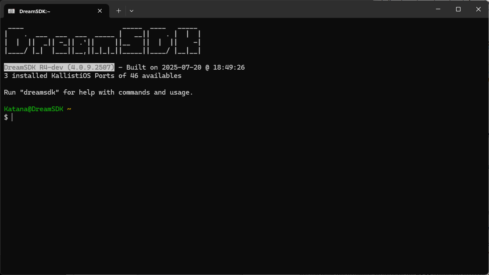

# Welcome to DreamSDK!

**DreamSDK is a modern, ready-to-use environment for the Sega Dreamcast
development, designed for the Microsoft Windows platform**.

By installing DreamSDK you can start developing for your Sega Dreamcast today,
on Windows OS, without bothering with toolchains, libraries or configuration. 
DreamSDK is used for producing Sega Dreamcast homebrews/games (i.e., Dreamcast
programs), even commercial ones, like 
[The Textorcist](https://gamefairy.io/product/textorcist-dreamcast-limited-to-666/)
or [Shadow Gangs](https://www.kickstarter.com/projects/jkmcorp/shadow-gangs-dreamcast-version)!

DreamSDK is a big package composed by a lot of free/open-source softwares,
mainly [KallistiOS](http://gamedev.allusion.net/softprj/kos/) (the library used
for interacting with the Sega Dreamcast hardware), the associated/required
[GNU toolchain](https://en.wikipedia.org/wiki/GNU_toolchain), and some special
programs made for this package
(e.g., [DreamSDK Manager](https://github.com/dreamsdk/manager)). DreamSDK is
compatible with Windows XP and greater (e.g, it has been well tested on Windows
1).

🌐 [**Browse the official website here**](https://www.dreamsdk.org/)
📥 [**Download the official release here**](https://github.com/dreamsdk/dreamsdk/releases)

## How to use DreamSDK after installing it?

After installing the package on your computer, you have 2 options:

* Use the **DreamSDK Shell** and then use the package directly from the command-line;
* Use an IDE: currently, only [Code::Blocks](http://codeblocks.org/) is
  officially supported.

## About GNU/Linux, macOS and WSL

If you are using **GNU/Linux** or **macOS**, DreamSDK is totally useless for you. 
As all required Sega Dreamcast components are based on GNU/Linux components, 
setuping a working environment for developing on Sega Dreamcast is pretty 
easy. You just have to follow the official steps described in the [KallistiOS 
documentation](http://gamedev.allusion.net/softprj/kos/setup.php). That's why 
DreamSDK won't support GNU/Linux or macOS because it isn't necessary.

If you are using [Windows Subsystem for Linux](https://en.wikipedia.org/wiki/Windows_Subsystem_for_Linux) 
(i.e., **WSL**) on Windows 10+, you can indeed avoid using DreamSDK as you have
a native Unix-like shell directly on your computer. However, using DreamSDK will 
facilitate the environment setup as all the toolchains and required components
are already compiled/ready to be used. Indeed, compiling the required toolchains
can take several hours to complete (mainly using the `dc-chain` utility provided
in the `utils/dc-chain` directory from the KallistiOS repository).

## Purpose of this repository

This repository contains everything you need to produce a **DreamSDK**
installation packages. Using this repository you'll be able to generate the 3
official installation packages ... :

* The ISO image - `DreamSDK-R<release_number>-Setup.iso`;
* The Padus DiscJuggler image (CDI) containing
  [dcload-ip](https://gitlab.com/kallistios/dcload-ip): 
  `DreamSDK-R<release_number>-dcload-ip-<dcload_version>.cdi`;
* The Padus DiscJuggler image (CDI) containing
  [dcload-serial](https://gitlab.com/kallistios/dcload-serial):
  `DreamSDK-R<release_number>-dcload-serial-<dcload_version>.cdi`.

... where `release_number` is the version of the DreamSDK you want to generate
(this is detailed in the `setup-generator` repository). ISO image hold the
full installer of DreamSDK for the computer while 
[Padus DiscJuggler images](https://en.wikipedia.org/wiki/DiscJuggler) (CDI) are
[bootable discs](https://en.wikipedia.org/wiki/MIL-CD) for your Sega Dreamcast, 
containing DreamSDK and the **dcload** program used for running your programs
and remote debugging (you have to choose your flavour, `dcload-serial` for your 
[Coders Cable](https://dreamcast.wiki/Coder%27s_cable) or `dcload-ip` if you 
have the luck to have a [Broadband Adapter](https://segaretro.org/Broadband_Adapter)).

To produce these 3 installation packages, you will need to install the
prerequisites and execute the 4 scripts described below, in the specified order.

## Prerequisites

First of all, you will need to install:

* [DreamSDK](https://dreamsdk.org) - yes, you will need a previous version of
  DreamSDK to produce a new one - [Eating your own dog food](https://en.wikipedia.org/wiki/Eating_your_own_dog_food)
  principle!
* [Lazarus IDE](https://www.lazarus-ide.org/) - DreamSDK components are written
  in [Free Pascal](https://www.freepascal.org/). You have to install the 32-bit
  extension as well.
* [Python 3](https://www.python.org/) - some scripts used in the generation
  process are written in Python.
* [Git](https://git-scm.com/) - used for retriving some components from Git
  repositories.
* [UPX](https://upx.github.io/) - DreamSDK binaries are packed with UPX.
* [7-Zip](https://www.7-zip.org/) - some scripts uses 7-Zip for compression.
* [Inno Setup 5](https://files.jrsoftware.org/is/5/innosetup-5.6.1-unicode.exe) -
  the tool used for creating the installer. Note that you should use the v5.x
  branch to keep Windows XP support.  

## Installing the prerequisites

### Cloning all repositories on your computer

You will need to **clone** the main DreamSDK repository (the one that contains
this [read-me](README.md) file). It could be whatever directory you want but
it's better to avoid spaces in the path.

After cloning this repository, please run the following script:

	.\scripts\init.cmd

All Git submodules should be downloaded.

### Installing the previous DreamSDK package

You may install the previous version of DreamSDK in the default directory.
Please note that only one version of DreamSDK can be installed on the computer
at this time (mainly, due to the usage of the `DREAMSDK_HOME` environment
variable), so if you want to test your generated package, it will uninstall the
previous one. Then you can use your installed package for regenerating another
one, as only a few utilities embedded in DreamSDK are used for producing the
package (e.g., `patch`...).

### Installing Lazarus IDE

Lazarus is a key component as every DreamSDK binaries are written in Free
Pascal. You may install the Lazarus IDE itself in 64-bit but all DreamSDK
binaries should be generated in 32-bit only, as DreamSDK is a package full of
32-bit binaries supporting Windows XP.

To install Lazarus IDE, you should install (assuming you're on 64-bit Windows):

1. Install `lazarus-{x.y.z}-fpc-{x.y.z}-win64.exe`
2. Install `lazarus-{x.y.z}-fpc-{x.y.z}-cross-i386-win32-win64.exe`
3. Start Lazarus IDE and create a new project (just to access to the main menu)
4. In the main menu, click on `Package` > `Online Package Manager...`.
5. Search for the following package: `Synapse`. Install the `Synapse {x.yy}`
   package by click on the `Install` button. Do the same with the
   `UniqueInstance` package. You may recreate the `Normal Profiles` if asked.

### Installing Python 3

You may install Python 3 using default settings.

Note that if you wish to test Python extensions for GDB, you will need to
install Python 32-bit, so you may install both 32-bit and 64-bit versions of
Python. You can of course make the 64-bit version primary. [You may click here
for more information](https://stackoverflow.com/a/12448411/3726096).

### Installing Git and 7-Zip

For all these components, you may use the standard installation process.

### Installing UPX

There is no installer for UPX, all you need to do is to extract it in a fixed
location.

### Installing Inno Setup 5

You need to install Inno Setup 5 (not the latest version) to keep Windows XP
support. You may find it on the 
[official website](https://files.jrsoftware.org/is/5/innosetup-5.6.1-unicode.exe)
or [cached here](https://github.com/dreamsdk/setup-generator/blob/master/tools/inno-setup/inno-setup.zip).

It could be useful to install
[Inno Script Studio](https://www.kymoto.org/products/inno-script-studio) as well
as this tool simplify the development of Inno Setup scripts.

## Building DreamSDK

For building DreamSDK, you need to configure then execute the 4 scripts
described below. You need to execute them in that order as they are dependencies
check between all of them.

### Step 1: Offline

The first script to execute is called `offline`.

Starting with **DreamSDK R3**, you have the possibility to use DreamSDK in an
offline mode only, that's why we need to embedded the components directly in the
Setup package. Of course the online mode is better and we encourage the user to
do so but sometime, you don't have the choice to be offline. The user can choose
the offline package directly when installing DreamSDK or later on through
DreamSDK Manager.

This script is preparing everything for embedding **KallistiOS**, **KOS Ports**,
**Dreamcast Tool** and **Ruby** libraries directly the DreamSDK Setup package.

### Step 2: Prepare

The `prepare` script is very important as it gather all the components used to
produces DreamSDK. This script is generating the `.sources` directory that will
be embedded in the **DreamSDK Setup** package.

...

### Step 3: MkSetup

The `mksetup` script will generate the **DreamSDK Setup** package itself.
Starting from that point, DreamSDK is ready to be used but not really
distributed officially, this is the purpose of the next step.

### Step 4: MkImage

This is the last script to use: `mkimage`. This will produce the official images
containing DreamSDK for distribution.

## About the Code::Blocks IDE integration

For building Code::Blocks you will need some more tools

...

(To be continued)

## About the submodules

(work in progress)

Repositories to clone are:

* [codeblocks-patcher](https://github.com/dreamsdk/codeblocks-patcher) - 
  patcher for adding DreamSDK support to [Code::Blocks IDE](http://codeblocks.org/)
* [common](https://github.com/dreamsdk/common) -
  common library/classes
* [documentation](https://github.com/dreamsdk/documentation) - 
  DreamSDK documentation in [CHM format](https://en.wikipedia.org/wiki/Microsoft_Compiled_HTML_Help)
* [dreamsdk](https://github.com/dreamsdk/dreamsdk) - this repository
* [helpers](https://github.com/dreamsdk/helpers) -
  some utilities used by DreamSDK itself
* [manager](https://github.com/dreamsdk/manager) -
  DreamSDK Manager, the central utility of the DreamSDK package
* [setup-generator](https://github.com/dreamsdk/setup-generator) -
  the [Inno Setup](https://jrsoftware.org/isinfo.php) script used for producting
  the setup files
* [setup-helpers](https://github.com/dreamsdk/setup-helpers) -
  some utilities only used by DreamSDK Setup
* [setup-packages](https://github.com/dreamsdk/setup-packages) -
  the packages that make DreamSDK itself
* [shell-launcher](https://github.com/dreamsdk/shell-launcher) -
  the main application of DreamSDK, the DreamSDK Shell
* [shell-runner](https://github.com/dreamsdk/shell-runner) -
  this utility is used for executing DreamSDK commands directly in Windows
  Shell.
* [system-objects](https://github.com/dreamsdk/system-objects) - some files used
  for converting a [standard MinGW installation](https://mingw.osdn.io/) into
  DreamSDK.